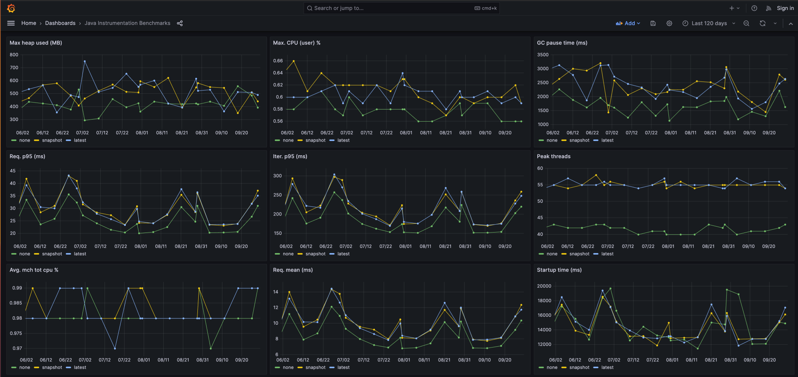

# Benchmark Metrics

## Context

Given a repository with a branch that includes reports of benchmark test runs, convert this data into timeseries metrics 
that can be visualized in grafana.

The motivation behind this project was to analyze the historical benchmark data from the
https://github.com/open-telemetry/opentelemetry-java-instrumentation project.

## Setup

It helps to have a github API key set via a `GITHUB_TOKEN` env variable, but not needed (although you might get rate limited)

You can run everything via docker

`docker compose up -d`

Access via [Grafana](http://localhost:3001/):

